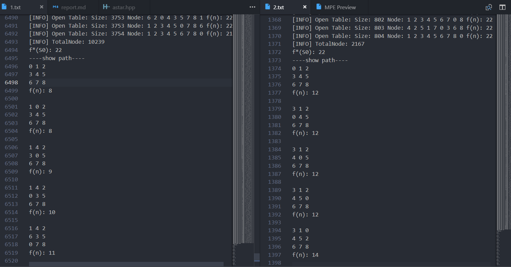

# A*算法
> A* 算法，A*（A-Star)算法是一种静态路网中求解最短路径最有效的直接搜索方法，也是解决许多搜索问题的有效算法。算法中的距离估算值与实际值越接近，最终搜索速度越快。

## 导言
使用了`C++`作为算法语言，利用`A*`算法求解八数码问题

---

## 利用A*算法解决八数码问题

* **定义结点**。主要保存当前数码序列以及其权值，同时保存其父节点，用于最后搜索完输出正确的移动路径，保存子结点主要是为了最后内存能够正确释放完。
    ```c++
    struct Node {
        int priority;               // 估价
        vector<int> order;          // 当前数码序列
        int blank;                  // 记录空格位置
        int status;                 // 层数
        Node* pre;                  // 父节点
        vector<Node*> child;        // 子结点

        Node(vector<int> &_order, Node *_pre, int _blank) {
            order = _order;
            pre = _pre;
            blank = _blank;
            status = 0;
        }

        friend bool operator<(Node a, Node b) {
            //重载小于号使得小的先出队列
            return a.priority > b.priority;
        }

        bool operator==(const Node &a) {
            return order == a.order;
        }

        Node operator=(const Node &a) {
            order = a.order;
            pre = a.pre;
            priority = a.priority;
            blank = a.blank;
        }
    };
    ```
* **估价**。有两种估价函数，`估价函数h1` 放错位置数目的数字的个数，`估价函数h2` 所有数字当前位置以最短路径走到正确位置的步数之和，通过参数选择相应的估价函数。对于八数码问题，我们将空格使用`0`表示，因此在给结点计算估价的时候需要忽略`0`
    ```cpp
    // 估价函数h1 放错位置数目的数字的个数
    int getValuationOfOne(Node* n, int problem = 8) {
        int num = 0;
        for(int i = 0; i <= 8; ++i) {
            if(n->order[i] != endOrder[i])
                ++num;
        }
        if(num == 0)    return 0;
        return problem == 9 ? num : num-1;
    }

    // 估价函数h2 所有数字当前位置以最短路径走到正确位置的步数之和
    int getValuationOfTwo(Node* n, int problem = 8) {
        int num = 0;
        for(int i = 0; i <= 8; ++i) {
            if (n->order[i] != endOrder[i] && n->order[i] != 0) {
                int index = getIndex(endOrder, n->order[i]);
                num += abs(i % 3 - index % 3) + abs(i / 3 - index / 3);
            }
            if (n->order[i] == 0 && problem == 9) {
                int index = getIndex(endOrder, n->order[i]);
                num += abs(i % 3 - index % 3) + abs(i / 3 - index / 3);
            }
        }
        return num;
    }

    // 估价函数选择
    int getValuation(Node* n, string choose = "h1", int problem = 8) {
        if(choose == "h1") 
            return getValuationOfOne(n, problem);
        else
            return getValuationOfTwo(n, problem);
    }
    ```
* **`A* `算法核心过程**。其核心过程与`BFS`搜索过程类似，把根节点推入队列中，每次从队列中弹出一个元素，搜索所有在它下一级的元素，把这些元素推入队列中，并把这个元素记为它下一级元素的前驱，找到所要找的元素时结束程序或如果遍历整个树还没有找到亦结束程序。A* 算法对于每次弹出的元素选择是启发式的，我们需要给每个结点进行估价，然后每次选择估价值最小的结点。同时我们需要对移动后生成的序列判断其是否已经存在与`Open`表或者`Close`表内，如果已经出现过，则不加入，这样减少了不必要的运算
    ```cpp
    // A* search
    void AStarSearch(vector<int>& cur, vector<int>& target, string choose = "h1", int problem = 8) {
        endOrder = target;

        // 获取空格的位置
        int blank = getIndex(cur, 0);
        Node* start = new Node(cur, nullptr, blank);
        Node *now = start;
        open.push(start);
        while(!open.empty()) {
            now = open.top();

            // 输出一些有效信息
            cout << "[INFO] Open Table: Size: " << open.size() << " Node: ";
            for(int i = 0; i <= 8; ++i) cout << now->order[i] << " ";
            cout << endl;

            open.pop();
            if(now->order == endOrder)   break;
            close.insert(now);

            // left
            if(now->blank % 3 != 0) {
                Node* node = move(now, (Direction)0);
                if(!close.count(node)) {
                    node->status = now->status + 1;
                    node->priority = getValuation(node, choose, problem) + node->status;
                    now->child.push_back(node);
                    ++totalNode;
                    open.push(node);
                }
            }

            // right
            if(now->blank % 3 != 2) {
                Node* node = move(now, (Direction)1);
                if (!close.count(node)) {
                    node->status = now->status + 1;
                    node->priority = getValuation(node, choose, problem) + node->status;
                    now->child.push_back(node);
                    ++totalNode;
                    open.push(node);
                }
            }

            // up
            if(now->blank / 3 != 0) {
                Node* node = move(now, (Direction)2);
                if (!close.count(node)) {
                    node->status = now->status + 1;
                    node->priority = getValuation(node, choose, problem) + node->status;
                    now->child.push_back(node);
                    ++totalNode;
                    open.push(node);
                }   
            }

            // down
            if(now->blank / 3 != 2) {
                Node* node = move(now, (Direction)3);
                if (!close.count(node)) {
                    node->status = now->status + 1;
                    node->priority = getValuation(node, choose, problem) + node->status;
                    now->child.push_back(node);
                    ++totalNode;
                    open.push(node);
                }
            }
        }

        getPath(now);

        memoryFree(start);
    }
    ```


---

## 八数码问题 比较两种估计函数 

> 详细输出可以自行运行，关于使用参考使用说明

### 测试
* **初始状态**
    ```
    0 1 2
    3 4 5 
    6 7 8
    ```
* **目标状态**
    ```
    1 2 3
    4 5 6
    7 8 9
    ```
* 估价函数 `f(n) = g(n) + h(n)`
    `估价函数h1` 放错位置数目的数字的个数
    `估价函数h2` 所有数字当前位置以最短路径走到正确位置的步数之和
* 两种估价函数的输出（八数码）
    
    其中`1.txt`为**h1**的输出结果，`2.txt`为**h2**的输出结果

### 对比
* 对于有解情况，两种估价函数搜索出来结果的深度是一样的，其移动路径不一定相同，但是对于估价函数`h1`，其总拓展的结点数比估价函数`h2`更多，其效率比较低。
* 估价函数`h1`是放错位置数目的数字的个数，其未考虑当前状态移动到目标状态的困难程度,而与之相比的估价函数`h2`是所有数字当前位置以最短路径走到正确位置的步数之和，其显然对于结点的估价更加合理，更加符合实际的情况，效率也更高
---

## 验证h1(n)的单调性以及验证凡A*算法挑选出来求后继的点n必定满足 `h(ni）≤1+h(nj）`
* 运行 `a.exe h1 > 1.txt`
* **初始状态**
    ```
    0 1 2
    3 4 5 
    6 7 8
    ```
* **目标状态**
    ```
    1 2 3
    4 5 6
    7 8 9
    ```
* `h1`结果输出
    ```
    f*(S0): 22
    ----show path----
    0 1 2 
    3 4 5 
    6 7 8 
    f(n): 8

    1 0 2 
    3 4 5 
    6 7 8 
    f(n): 8

    1 4 2 
    3 0 5 
    6 7 8 
    f(n): 9

    1 4 2 
    0 3 5 
    6 7 8 
    f(n): 10

    1 4 2 
    6 3 5 
    0 7 8 
    f(n): 11

    1 4 2 
    6 3 5 
    7 0 8 
    f(n): 11

    1 4 2 
    6 3 5 
    7 8 0 
    f(n): 10

    1 4 2 
    6 3 0 
    7 8 5 
    f(n): 12

    1 4 2 
    6 0 3 
    7 8 5 
    f(n): 13

    1 4 2 
    0 6 3 
    7 8 5 
    f(n): 14

    1 4 2 
    7 6 3 
    0 8 5 
    f(n): 16

    1 4 2 
    7 6 3 
    8 0 5 
    f(n): 18

    1 4 2 
    7 0 3 
    8 6 5 
    f(n): 19

    1 0 2 
    7 4 3 
    8 6 5 
    f(n): 20

    1 2 0 
    7 4 3 
    8 6 5 
    f(n): 20

    1 2 3 
    7 4 0 
    8 6 5 
    f(n): 20

    1 2 3 
    7 4 5 
    8 6 0 
    f(n): 20

    1 2 3 
    7 4 5 
    8 0 6 
    f(n): 22

    1 2 3 
    7 4 5 
    0 8 6 
    f(n): 22

    1 2 3 
    0 4 5 
    7 8 6 
    f(n): 22

    1 2 3 
    4 0 5 
    7 8 6 
    f(n): 22

    1 2 3 
    4 5 0 
    7 8 6 
    f(n): 22

    1 2 3 
    4 5 6 
    7 8 0 
    f(n): 22
    ```
* 经过多组测试，验证`h1(n)`的单调性，凡`A*`算法挑选出来求后继的点`ni`扩展的一个子结点`nj`，满足: `h(ni）≤1+h(nj）`
* `h2`结果输出
    ```
    f*(S0): 22
    ----show path----
    0 1 2 
    3 4 5 
    6 7 8 
    f(n): 12

    3 1 2 
    0 4 5 
    6 7 8 
    f(n): 12

    3 1 2 
    4 0 5 
    6 7 8 
    f(n): 12

    3 1 2 
    4 5 0 
    6 7 8 
    f(n): 12

    3 1 0 
    4 5 2 
    6 7 8 
    f(n): 14

    3 0 1 
    4 5 2 
    6 7 8 
    f(n): 16

    0 3 1 
    4 5 2 
    6 7 8 
    f(n): 16

    4 3 1 
    0 5 2 
    6 7 8 
    f(n): 18

    4 3 1 
    6 5 2 
    0 7 8 
    f(n): 18

    4 3 1 
    6 5 2 
    7 0 8 
    f(n): 18

    4 3 1 
    6 0 2 
    7 5 8 
    f(n): 20

    4 0 1 
    6 3 2 
    7 5 8 
    f(n): 22

    4 1 0 
    6 3 2 
    7 5 8 
    f(n): 22

    4 1 2 
    6 3 0 
    7 5 8 
    f(n): 22

    4 1 2 
    6 0 3 
    7 5 8 
    f(n): 22

    4 1 2 
    0 6 3 
    7 5 8 
    f(n): 22

    0 1 2 
    4 6 3 
    7 5 8 
    f(n): 22

    1 0 2 
    4 6 3 
    7 5 8 
    f(n): 22

    1 2 0 
    4 6 3 
    7 5 8 
    f(n): 22

    1 2 3 
    4 6 0 
    7 5 8 
    f(n): 22

    1 2 3 
    4 0 6 
    7 5 8 
    f(n): 22

    1 2 3 
    4 5 6 
    7 0 8 
    f(n): 22

    1 2 3 
    4 5 6 
    7 8 0 
    f(n): 22
    ```
* 同时经过`h2`也验证凡`A*`算法挑选出来求后继的点`n`必定满足: `f(n）≤f*(S0）`


## 利用A*算法求解九数码问题
* 关于**九数码问题**的定义，九数码问题似乎并不常见并且并没有给出比较标准的定义，以下为其一定义
    > 将拼盘外围的8个方格按顺时针挪一个位置，将中间一行向右移动一个位置，最右边的方格被移到最左边

    本来是按照这个规则来使用A\*算法解决九数码问题的，但是其实其只有两种移动方式，使用A\*算法与普通的BFS效率差不多。然后在展示的时候发现大家似乎都是的九数码问题都是将空格变成`0`，在计算估值的时候包含，移动规则与八数码相同。然后修改代码，需要修改的部分比较少，对于八数码问题，是使用`0`表示空格，并且对于结点估价的时候不加入，而现在对于九数码问题，只需要在计算估价的时候也需要计算`0`的即可，代码改动不多。

* 九数码问题的结果，经过多组数据测试，发现**对于两种估价函数，其路径深度是相同的，但是拓展结点数h1多余h2，其求解相同的问题的搜索图是相同的**
---

## 能否达到目标状态的判断方法
对于八数码问题，判断其是否能从一个给定的初始状态变换成目标状态，其判断方法也比较简单
一个状态表示成一维的形式，求出除0之外所有数字的逆序数之和，也就是每个数字前面比它大的数字的个数的和，称为这个状态的逆序。该表示等价于某个数后面有比它小的数字的个数
**若两个状态的逆序奇偶性相同，则可相互到达，否则不可相互到达。**
> 证明： https://blog.csdn.net/tiaotiaoyly/article/details/2008233

```cpp
// 计算序列的逆序数
int getReverse(vector<int>& order) {
    int num = 0;
    for(int i = 0; i < 8; ++i) {
        if(order[i] == 0)   continue;
        for(int j = i + 1; j <= 8; ++j) {
            if (order[j] == 0) continue;
            if(order[i] > order[j]) ++num;
        }
    }
    return num;
}
```
---
